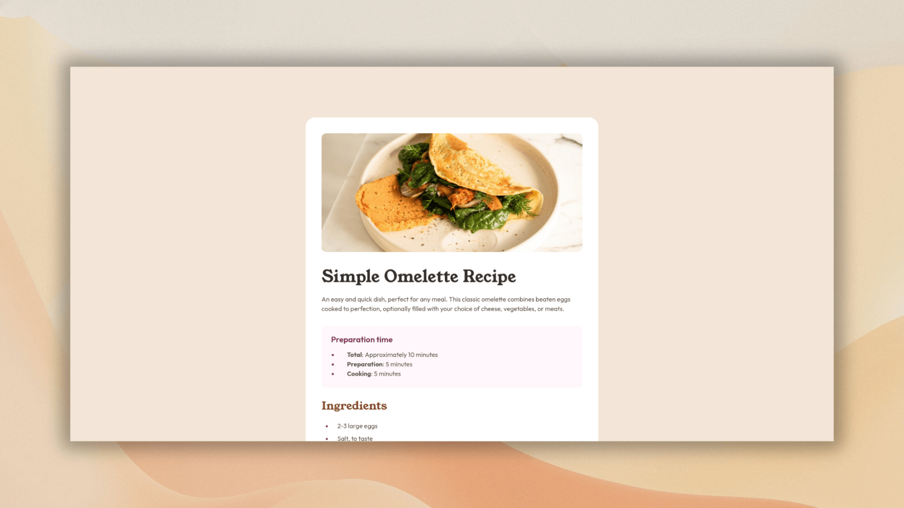

# Frontend Mentor - Recipe page solution

This is a solution to the [Recipe page challenge on Frontend Mentor](https://www.frontendmentor.io/challenges/recipe-page-KiTsR8QQKm). Frontend Mentor challenges help you improve your coding skills by building realistic projects.

## Table of contents

- [Overview](#overview)
  - [Screenshot](#screenshot)
  - [Links](#links)
- [My process](#my-process)
  - [Built with](#built-with)
  - [What I learned](#what-i-learned)
  - [Continued development](#continued-development)
  - [Useful resources](#useful-resources)
- [Author](#author)

## Overview

### Screenshot



### Links

- Live Site URL: [recipe-page](https://youssef-el-atmani.github.io/recipe-page/)

## My process

### Built with

- Semantic HTML5 markup
- CSS custom properties
- Flexbox
- Mobile-first workflow

### What I learned

#### Text decoration

I learned how to manipulate the underline for links and general text

#### Custom downloaded fonts

I learned how to use custom fonts using `@font-face`

#### Mobile-first workflow

I learned about **mobile-first-workflow**, maybe I didn't apply it the right way, but this is the first time I apply it, and in its way, I learned about working with `@media` queries.

### Continued development

I will focus on developing the implementation of **mobile-first-workflow**.

### Useful resources

- [Text decoration by MDN](https://developer.mozilla.org/en-US/docs/Web/CSS/Reference/Properties/text-decoration) - This helped learn how to style the anchor's underline.
- [Styling lists](https://developer.mozilla.org/en-US/docs/Learn_web_development/Core/Text_styling/Styling_lists) - This teaches me everything I need to know about styling lists.
- [Web fonts](https://developer.mozilla.org/en-US/docs/Learn_web_development/Core/Text_styling/Web_fonts) - This helped me know how to apply custom fonts the right way.
- [Transfonter](https://transfonter.org/) - It's a web-service, I used it to convert `.ttf` font's format to `WOFF/WOFF2` format, also it is very helpful because it provide a CSS file with the converted fonts that is ready to copy from, for example, it generates something similar to the following for each font you convert:

```CSS
@font-face {
  font-family: "Outfit-Regular";
  src:
    url("./../assets/fonts/outfit/woff-woff2/Outfit-Regular.woff2")
      format("woff2"),
    url("./../assets/fonts/outfit/woff-woff2/Outfit-Regular.woff")
      format("woff");
  font-weight: normal;
  font-style: normal;
  font-display: swap;
}
```

The only thing lefts to do, is to edit the `font-family` name with a name that suits you, and edit the paths so that they point to where you placed the converted fonts

## Author

- Frontend Mentor - [@youssef-el-atmani](https://www.frontendmentor.io/profile/youssef-el-atmani)
- Twitter - [@y_el_atmani](https://x.com/y_el_atmani)

## Attribution

The background image used in the [screenshot](#screenshot) is by [Pawel Czerwinski](https://unsplash.com/@pawel_czerwinski) on **Unsplash**.
